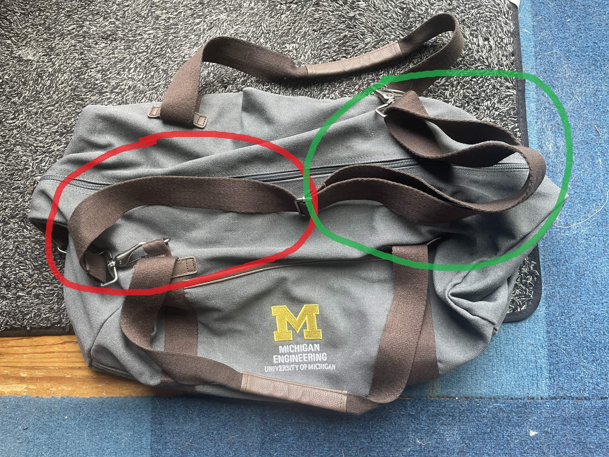

Upon recently completing the [SURE program](https://sure.engin.umich.edu/) I was given a very nice, CoE-coded messenger bag. It's a wonderful bag, with sturdy handles and great construction. I particularly like the muted grey-brown tone going on. As it was resting on my bed the other day, I starting thinking about how its adjustable strap system worked. 

The strap works by feeding part of the strap into a "fold-over" section, thus shortening the length by doubling some of it over. The singular section is circled in red, with the folded-over in green. I began wondering a simple question that could be answered mathematically:

*From a starting, completely unfurled length $s$, how could I calculate the length of the resulting strap as a function of how much of the strap $x$ is fed into into the "fold-over" section?*

I'm somewhat happy with myself that I did find an "applied math" example in the real world - however minor it may be. Even with a full year of abstract proof hammering I was able to spot *something* modellable! In the moment, however, I got frustrated. I began thinking through various possibilities. Was I understanding the "fold-over" system correctly? What happens if I started with the strap completely doubled-over? What if some was doubled-over and other parts weren't? 

Perhaps most damning, a few minutes in I was lying on bed annoyedly wondering: why haven't I figured this out yet? In retrospect this thought added nothing, yet completely consumed my mind. I was so overtaken with concern that I couldn't "intuitively solve the problem" that I had stopped trying to solve the problem. I wondered if a truly worthy Michigan Honors Math students would struggle to the same degree I did - and feared I somehow wasn't making the cut.

Of course, all of this was but a small subset of the imposter syndrome war I had been (and still do?) waging against myself as an Honors Math student. This was a war fought by worrying about my success more than contributing to it. Somewhere on the surface I know it's not worth my time to actually be anxious about these things, but deep down it's so difficult to let go. 

I think I have too pure an image of the ideal problem-solver, when really I was already one. The answer, as I came up with the following morning in the airport (sleep does wonders for your reasoning) is pretty simple:

$$
(s - x) + \frac{1}{2}x = s - \frac{1}{2}x
$$

where $(s-x)$ represents the single strap and the amount being removed from it, and where $\frac{1}{2}x$ represents only half of that removed piece coming back as it gets "folded over." This passes the obvious vibe check of resulting in $s$ when $x=0$, leaving the entire single strap, and $\frac{1}{2}s$ when $x=s$ as the entire strap gets doubled over. Surprisingly, this has a nice application! If you desire the strap to be a specific length, you can completely unfurl the strap and then use the function to find the amount you need to insert into the buckle for your desired final length.

Or just vibe it and see how it fits on your shoulder. That works too.

