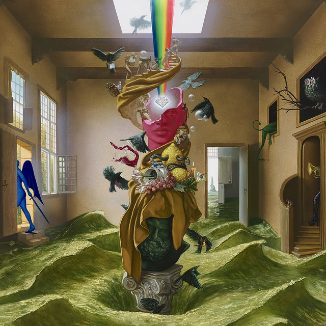
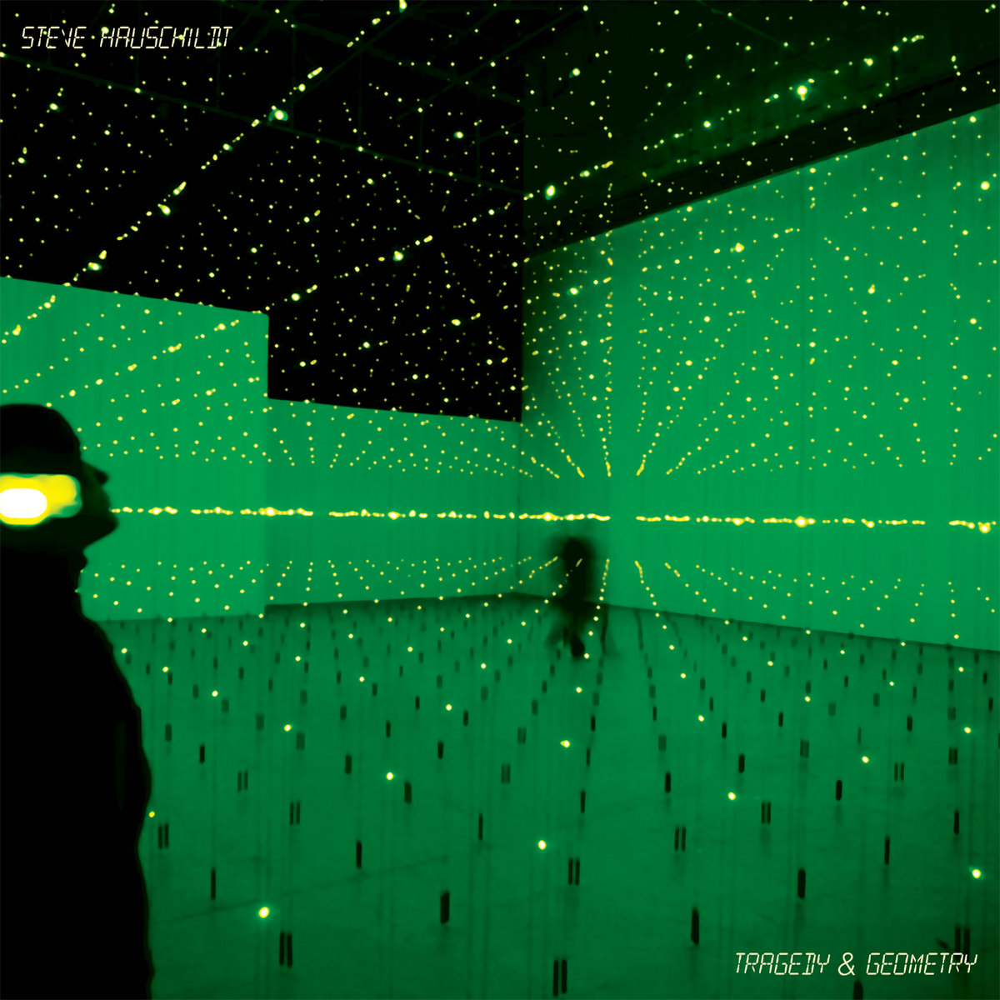

The music we listen to is rather personal. I'd wager that for every one of us, we each have a totally unique intersection of artists and sounds we like and dislike. In this article, I'm going to highlight some albums I'm particularly fond of just for the fun of it. Maybe I'll come back in a few years and find my tastes have totally changed. In no particular order...

## 1. *Paradise State of Mind*, Foster the People

Foster the People originally became popular through their pop-electronica album *Torches,* and you may know their songs "Pumped Up Kicks" and "Sit Next to Me." Mark Foster (the band's namesake) has creatively flexed between different styles of pop in the band's work, and I've come to thoroughly enjoy all of it! 

This album from 2024 has a funky-psychedelic feel that carries a distinct tone and rhythm. "Glitchzig" and "Feed Me" are the most experimental songs, with stripped down and jarring chords, but creatively expressive nonetheless. "Take Me Back" reflects on the process of growth.
I don't think I ever quite understood the "hype" music can build until PSOM was announced, and I eagerly await whatever Foster brings to the table next.

Favorite Song: "Paradise State of Mind." It's entrancing, spiritual, and exestential in its lyrics, with a second half strongly inspired by Gospel classics.

## 2. *Tradgedy and Geometery*, Steve Hauschildt

I don't remember how I discovered Hauschildt, but I'm very glad I did. He is a relatively popular ambient music artist, with most of his songs lacking true drums or rhythm. Still, his music evokes strong emotions - sometimes more strongly for me than "real instruments" do! Compared to his other albums, this one pushes emergences in its soundscapes, with most songs carrying a bubbly tune as opposed to long, drawn out motions. Each track evokes a new sense of beyond-ness, from a warm surrounding in "Already Replaced" to cold forebaring in "Overnight Venusian" to the awe-inspiring album-close of "Stare Into Space". *Tradgedy and Geometery* is beautiful and pensive, perfectly encapsulating that naive wonder I get working on the top floor of the library late at night.

Favorite Song: "Batteries May Drain." The most structured song on the album, "Batteries May Drain" kicks in like a well-trodden path of adventure, both calming and inviting to look forward.

## 3. *Odyssey*, HOME

HOME is a well-known vaporwave-ish artist featured in many spacey, otherworldly content online (most comedic of which may be [Simpsonwave](https://www.youtube.com/playlist?list=PL2prRm3XQsNSUdvtv6M_pRoCIp-d7si09), starring America's favorite yellow family). I first encountered him through Summoning Salt, a YouTube creator documenting video game speedrun histories. HOME offers deep, stirring waves of sound, with *Odyssey* acting as the stage-setting exemplar as his debut album. Most people use "nostalgic" to describe HOME's style, rejecting a happy/sad, major/minor spectrum in favor of trying to capture a misty, wistful tone. I personally think most of the songs are more positive than negative; reflective hope instead of lost and longing. "Native" and "Odyssey" embody this strongest. All the tracks carry a weight and calm severity. Internet-famous "Resonance" may be one of the most emotional electronic pieces of music I've encountered.

Favorite Song: "New Machines." Happy nostalgia, especially in the opening triplet of melodies.

## 4. *Gas 0095*, Gas (Mat Jarvis)

*Gas 0095* is the epitome of "techy" techno. Mat Jarvis features silly and short songs, most notably *Miniscule* clocking in at two milliseconds, yet also long, drawn-out developing soundscapes. Compared to more "ambient" artists, perhaps Voices From The Lake, Jarvis' "real" techno songs on the album have punchy energy - yet are not as repetitive and droning. They feature a kind of curious steadiness. His songs actively explore and branch out. This album is space; it's electronics; it's science, really. *Microscopic* is notably featured in CGP Grey's [
"A4 Paper Should Be Impossible"](youtube.com/watch?v=pUF5esTscZI&vl=en) video, featuring the size and scale of the universe from A4 paper. It's also kind of weird how old (relative to the perspective of someone born in 2007) *Gas 0095* album is - I tease my parents, who are Radiohead fans, with the fact that *Gas 0095* came out before *OK Computer.*

I've never quite found anything else that pricks my inner techno love like this album. Mat Jarvis has continued to release music as recently as 2023 under the name of High Skies, but these newer songs featuring more ambience and less pulse compared to *0095.* 

Favorite Song: "Experiments on Live Electricity." The song really sets me into a groove of thinking, ideally about whatever work I have in front of me. It's rather bare, to be honest, but clean and driving.

## 5. *PPPPPP*, Magnus Palsson

Chiptune is a weird genre, defined by intentionally making "retro" and/or "8-bit" sounding music. I'd argue many of its greatest hits come from video games also attempting to match that vibe - *PPPPPP* fits the mold, hailing as the soundtrack from Terry Cavanagh's quirky *VVVVVV*. *VVVVVV* is an intensely minimalist puzzle-platformer about determination and not giving up (you'll feel the temptation to plenty of times on your first run-through) and Palsson neatly captures this energy in every chirp and crisp beat of *PPPPPP*, especially in the aptly titled "Pushing Onwards." With Palsson's talent, you'll find yourself wondering why digital music actually needed to progress past that SNES-era charm. I find the album is paired best with the game for maximum retro-throwback enjoyment.

Favorite Song: "Potential for Anything." This song was the only thing keeping me going during The Laboratory on my initial playthrough of *VVVVVV*.

## 6. *Disorganized Fun*, Ronald Jenkees

I encountered Ronald Jenkees through soundtracks to Minecraft building videos. His songs are all heavily electronic, featuring heavy synth, but also plenty of piano (a shining example being "Piano Wire" from *Days Away*) and strings (*Alpha Numeric*). I love the alive, jazzy feel and simple passion in all his work. *Disorganized Fun* is by no means a standout album of his, as I honestly enjoy all of them about equally, but it best captures what I've come to appreciate in Jenkees in this album's gliding, snappy electronic beats.

Rumor has it that Jenkees' 6th album is just around the corner!

Favorite Song: "Stay Crunchy." Jenkees' most popular song, striking and rich with sound.

## 7. *TAB_OUT*, Mr Rock

By far the most niche and out-of-the way artist on this list, I discovered Mr. Rock through their Wii Song remixes many, many years ago. Somehow I was led to their Amazon Music page, where I found a smattering of pure electronica songs with high-pitched, powerful drops. The name *TAB_OUT* comes from the first letters of its songs, including the "\_," due to surprisingly catchy song "\_\_\_...\_.\_\_.\_," and the album features a wide array of smooth and rhythmic tunes.

Favorite Song: "Understand." A lush, relaxing ebb and flow for the anxious moments in life.

